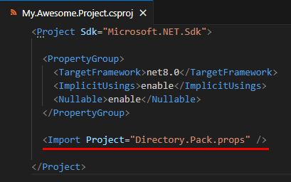

# Package Metadata Template

- `NuGet` package metadata template
- `MSBuild` property format (.props)
- Useful **guidelines** included!

## Getting started

### Prerequisites

- .NET SDK 7.0.100 or higher

### Install this template

```shell
dotnet new install Nemonuri.PackageMetadatas.Templates
```

## Usage

### 1. Create files by using this template
```shell
cd path/to/your/project
dotnet new pkgprop
```

### 2. Modify created files


#### *.Pack.props


#### `READMD.md` and `icon_128x128.png` (*.Pack.Resources)


### 3. Import `*.Pack.props` to your project



### 4. Done!

All package metadata is configured!

## Additional Documentation

- [dotnet pack](https://learn.microsoft.com/en-us/dotnet/core/tools/dotnet-pack)

## Feedback

If you have any issue, report to [the GitHub repository](https://github.com/nemonuri/package-metadatas-templates).